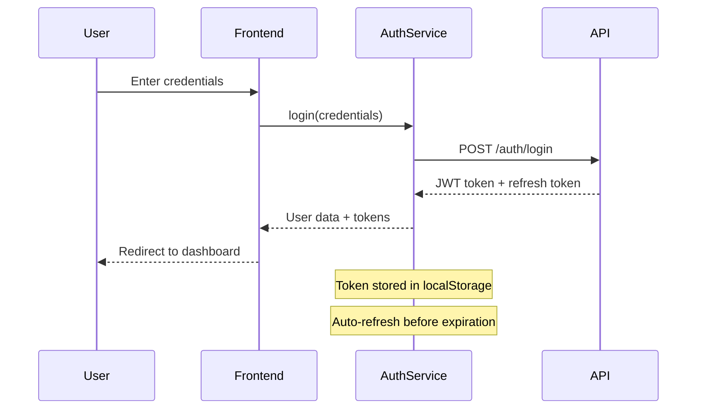

<div align="center">

# 🏢 Enterprise Admin Dashboard

### Modern Angular 18 Administrative Panel with Advanced Features

[](https://angular.io/)
[](https://typescriptlang.org/)
[](https://tailwindcss.com/)
[](https://chartjs.org/)

[](https://opensource.org/licenses/MIT)
[]()
[]()

[🚀 Live Demo](https://admin-dashboard-demo.vercel.app) • [📖 Documentation](https://docs.admin-dashboard.com) • [🐛 Report Bug](https://github.com/yourusername/admin-dashboard/issues) • [✨ Request Feature](https://github.com/yourusername/admin-dashboard/discussions)

</div>

---

## 🌟 Overview

### Enterprise-Grade Admin Solution

A **cutting-edge administrative dashboard** built with Angular 18, designed for modern enterprises seeking scalable, maintainable, and feature-rich management interfaces. This solution combines the latest web technologies with enterprise-grade architecture patterns.

### Key Highlights

- 🚀 **Next-Gen Angular**: Built with Angular 18 standalone components
- ⚡ **Performance Optimized**: Lazy-loaded modules and Angular Signals
- 🎨 **Modern UI/UX**: TailwindCSS with responsive design
- 🔐 **Enterprise Security**: Role-based access control and JWT authentication
- 📊 **Advanced Analytics**: Interactive charts and real-time dashboards
- 🛠️ **Developer Experience**: Clean architecture and reusable components

---

## 📸 Application Screenshots

<div align="center">

### 🏠 Dashboard Overview


### 👥 User Management
<table>
  <tr>
    <td></td>
    <td></td>
  </tr>
</table>

### 📊 Analytics & Reports
<table>
  <tr>
    <td></td>
    <td></td>
  </tr>
</table>

</div>

---

## ✨ Feature Matrix

### 🟢 Core Features (Implemented)

| Feature | Status | Description |
|---------|--------|-------------|
| 🔐 **Authentication System** | ✅ Complete | JWT-based auth with refresh tokens |
| 👥 **User Management** | ✅ Complete | Full CRUD with role assignment |
| 📊 **Dashboard Analytics** | ✅ Complete | Interactive charts and KPI cards |
| 🎨 **Responsive UI** | ✅ Complete | Mobile-first TailwindCSS design |
| 🌓 **Theme System** | ✅ Complete | Dark/Light mode with preferences |
| 🔒 **Role-Based Access** | ✅ Complete | Granular permission system |
| 📱 **Mobile Support** | ✅ Complete | Responsive across all devices |
| ⚡ **Performance** | ✅ Complete | Lazy loading and optimization |

### 🟡 Business Features (In Progress)

| Feature | Status | Priority | ETA |
|---------|--------|----------|-----|
| 📦 **Product Management** | 🚧 60% | High | Q1 2024 |
| 🏷️ **Category Management** | 🚧 40% | High | Q1 2024 |
| 📋 **Order Management** | 🚧 30% | Medium | Q2 2024 |
| 📈 **Advanced Reports** | 🚧 20% | Medium | Q2 2024 |

### 🔴 Future Enhancements

| Feature | Priority | Description |
|---------|----------|-------------|
| 🌐 **API Integration** | Critical | Replace mock data with real API |
| 📧 **Email System** | High | Notification and communication |
| 🔍 **Advanced Search** | High | Global search with filters |
| 🌍 **Internationalization** | Medium | Multi-language support |
| 📱 **PWA Features** | Medium | Offline capability |
| 🤖 **AI Integration** | Low | Smart insights and automation |

---

## 🏗️ Architecture & Technology

### 🛠️ Technology Stack

<div align="center">

| Layer | Technology | Version | Purpose |
|-------|------------|---------|---------|
| **Frontend** | Angular | 18.2.0 | Core framework |
| **Language** | TypeScript | 5.5.0 | Type safety |
| **Styling** | TailwindCSS | 3.4.0 | UI styling |
| **State** | Angular Signals | Built-in | Reactive state |
| **HTTP** | RxJS | 7.8.0 | Async operations |
| **Charts** | Chart.js | 4.5.1 | Data visualization |
| **Build** | Angular CLI + Vite | 18.2.0 | Development tools |
| **Testing** | Jasmine + Karma | Latest | Unit testing |

</div>

### 🏛️ Architecture Principles

- **🔄 Reactive Programming**: RxJS and Angular Signals for efficient state management
- **📦 Modular Design**: Feature-based modules with lazy loading
- **🧩 Component Library**: Reusable UI components with consistent API
- **🛡️ Security First**: Guards, interceptors, and sanitization
- **⚡ Performance**: OnPush change detection and tree-shaking
- **🧪 Testable**: Dependency injection and modular architecture

---

## 📁 Project Structure

```
admin-dashboard/
├── 🔧 Configuration Files
│   ├── angular.json                    # Angular CLI configuration
│   ├── tailwind.config.js             # TailwindCSS configuration
│   ├── tsconfig.json                  # TypeScript configuration
│   └── package.json                   # Dependencies and scripts
│
├── 📱 Source Code (src/)
│   ├── 🎯 Core Architecture (app/core/)
│   │   ├── guards/                     # Route protection
│   │   │   ├── auth.guard.ts          # Authentication guard
│   │   │   └── role.guard.ts          # Role-based access guard
│   │   ├── interceptors/              # HTTP interceptors
│   │   │   ├── auth.interceptor.ts    # Token injection
│   │   │   ├── error.interceptor.ts   # Global error handling
│   │   │   └── loading.interceptor.ts # Loading state management
│   │   └── services/                  # Core business services
│   │       ├── auth.service.ts        # Authentication logic
│   │       ├── mock-api.service.ts    # Mock data provider
│   │       ├── permissions.service.ts # Role management
│   │       └── theme.service.ts       # Theme management
│   │
│   ├── 🏢 Business Features (app/features/)
│   │   ├── analytics/                 # Data visualization
│   │   ├── auth/                      # Login/logout flows
│   │   ├── categories/                # Category management
│   │   ├── dashboard/                 # Main dashboard
│   │   ├── orders/                    # Order processing
│   │   ├── products/                  # Product catalog
│   │   ├── settings/                  # User preferences
│   │   └── users/                     # User administration
│   │
│   ├── 🎨 Layout Components (app/layout/)
│   │   ├── header/                    # Top navigation
│   │   ├── sidebar/                   # Side navigation
│   │   └── layout.component.ts       # Main layout wrapper
│   │
│   ├── 🧩 Shared Resources (app/shared/)
│   │   ├── components/                # Reusable UI components
│   │   │   ├── button/               # Button variants
│   │   │   ├── card/                 # Content containers
│   │   │   ├── chart/                # Chart wrapper
│   │   │   ├── form-field/           # Form inputs
│   │   │   ├── loading/              # Loading states
│   │   │   ├── modal/                # Dialog modals
│   │   │   └── table/                # Data tables
│   │   └── pages/                    # Shared page templates
│   │       ├── forbidden/            # 403 error page
│   │       └── not-found/            # 404 error page
│   │
│   ├── 🌍 Environment Configuration (environments/)
│   │   ├── environment.ts            # Development config
│   │   └── environment.prod.ts       # Production config
│   │
│   └── 📄 Application Entry Points
│       ├── index.html                # Main HTML template
│       ├── main.ts                   # Application bootstrap
│       └── styles.scss               # Global styles
│
└── 📚 Documentation & Assets
    ├── README.md                      # This documentation
    ├── LICENSE.md                     # MIT license
    └── docs/                          # Additional documentation
        ├── CONTRIBUTING.md            # Contribution guidelines
        ├── DEPLOYMENT.md              # Deployment instructions
        └── API.md                     # API documentation
```

---

## 🚀 Quick Start Guide

### 📋 Prerequisites

Ensure you have the following installed:

- **Node.js** (v18.0.0 or higher) - [Download](https://nodejs.org/)
- **npm** (v9.0.0 or higher) or **yarn** (v1.22.0 or higher)
- **Angular CLI** (v18.0.0 or higher)

### ⚡ Installation

1. **Clone the repository**
   ```bash
   git clone https://github.com/yourusername/admin-dashboard.git
   cd admin-dashboard
   ```

2. **Install dependencies**
   ```bash
   # Using npm
   npm install
   
   # Using yarn
   yarn install
   ```

3. **Install Angular CLI globally (if needed)**
   ```bash
   npm install -g @angular/cli@18
   ```

4. **Verify installation**
   ```bash
   ng version
   node --version
   npm --version
   ```

### 🏃‍♂️ Development Server

```bash
# Start development server
npm start

# Alternative with custom port
ng serve --port 4300

# Open browser automatically
ng serve --open
```

Navigate to `http://localhost:4200/`. The application will automatically reload when you change source files.

### 🏗️ Building for Production

```bash
# Production build
npm run build

# Build with custom configuration
ng build --configuration production

# Analyze bundle size
ng build --stats-json
npx webpack-bundle-analyzer dist/admin-dashboard/stats.json
```

---

## ⚙️ Configuration

### 🌍 Environment Variables

#### Development (`src/environments/environment.ts`)
```typescript
export const environment = {
  production: false,
  apiBaseUrl: 'http://localhost:3000/api',
  enableMockApi: true,
  
  // Application settings
  appName: 'Enterprise Admin Dashboard',
  appVersion: '2.0.0',
  
  // Feature flags
  features: {
    enableAnalytics: true,
    enableNotifications: true,
    enableDarkMode: true,
    enableMultiLanguage: false,
    enableRealTimeUpdates: true
  },
  
  // Authentication configuration
  auth: {
    tokenExpirationTime: 86400000,        // 24 hours
    refreshTokenExpirationTime: 604800000, // 7 days
    loginRedirectUrl: '/dashboard',
    logoutRedirectUrl: '/login',
    enableRememberMe: true
  },
  
  // API endpoints
  endpoints: {
    auth: '/auth',
    users: '/users',
    products: '/products',
    categories: '/categories',
    orders: '/orders',
    analytics: '/analytics'
  },
  
  // Third-party integrations
  integrations: {
    googleAnalytics: 'GA_MEASUREMENT_ID',
    sentry: 'SENTRY_DSN',
    stripe: 'STRIPE_PUBLIC_KEY'
  }
};
```

#### Production (`src/environments/environment.prod.ts`)
```typescript
export const environment = {
  production: true,
  apiBaseUrl: 'https://api.yourdomain.com',
  enableMockApi: false,
  // ... production-specific overrides
};
```

### 🎨 Theme Configuration

#### Customizing TailwindCSS (`tailwind.config.js`)
```javascript
module.exports = {
  content: ['./src/**/*.{html,ts}'],
  darkMode: 'class',
  theme: {
    extend: {
      colors: {
        primary: {
          50: '#eff6ff',
          500: '#3b82f6',
          900: '#1e3a8a',
        },
        // Custom brand colors
        brand: {
          primary: '#your-primary-color',
          secondary: '#your-secondary-color',
        }
      },
      fontFamily: {
        sans: ['Inter', 'system-ui', 'sans-serif'],
      },
      animation: {
        'fade-in': 'fadeIn 0.5s ease-in-out',
        'slide-up': 'slideUp 0.3s ease-out',
      }
    }
  },
  plugins: [
    require('@tailwindcss/forms'),
    require('@tailwindcss/typography'),
  ]
};
```

---

## 🔐 Authentication & Security

### 🛡️ Security Features

- **JWT Token Authentication** with automatic refresh
- **Role-Based Access Control (RBAC)** with granular permissions
- **Route Guards** for authentication and authorization
- **HTTP Interceptors** for secure API communication
- **XSS Protection** with Angular's built-in sanitization
- **CSRF Protection** for form submissions

### 👤 Default User Accounts

For testing and development:

```typescript
// Administrator Account
{
  email: 'admin@company.com',
  password: 'Admin@123',
  role: 'admin',
  permissions: ['*'] // Full access
}

// Manager Account
{
  email: 'manager@company.com',
  password: 'Manager@123',
  role: 'manager',
  permissions: ['users:read', 'users:write', 'products:*']
}

// Standard User Account
{
  email: 'user@company.com',
  password: 'User@123',
  role: 'user',
  permissions: ['dashboard:read', 'profile:write']
}
```

### 🔑 Authentication Flow



---

## 📊 State Management with Angular Signals

### 🚀 Modern Reactive State Management

Angular Signals provide a new reactive programming model that's more efficient and easier to use than traditional RxJS-based state management.

### 📈 Benefits

- **🎯 Fine-grained reactivity**: Only update what actually changed
- **⚡ Better performance**: Optimized change detection
- **🧩 Simplified syntax**: Less boilerplate code
- **🔄 Automatic updates**: UI automatically reflects state changes
- **🎨 Better devtools**: Improved debugging experience

### 💡 Usage Examples

#### Service with Signals
```typescript
@Injectable({
  providedIn: 'root'
})
export class UserService {
  // Private writable signals
  private readonly _users = signal<User[]>([]);
  private readonly _loading = signal<boolean>(false);
  private readonly _error = signal<string | null>(null);
  
  // Public readonly signals
  readonly users = this._users.asReadonly();
  readonly loading = this._loading.asReadonly();
  readonly error = this._error.asReadonly();
  
  // Computed properties
  readonly userCount = computed(() => this.users().length);
  readonly activeUsers = computed(() => 
    this.users().filter(user => user.isActive)
  );
  
  constructor(private http: HttpClient) {}
  
  async loadUsers(): Promise<void> {
    this._loading.set(true);
    this._error.set(null);
    
    try {
      const users = await firstValueFrom(
        this.http.get<User[]>('/api/users')
      );
      this._users.set(users);
    } catch (error) {
      this._error.set('Failed to load users');
    } finally {
      this._loading.set(false);
    }
  }
  
  addUser(user: User): void {
    this._users.update(users => [...users, user]);
  }
  
  updateUser(id: string, updates: Partial<User>): void {
    this._users.update(users =>
      users.map(user =>
        user.id === id ? { ...user, ...updates } : user
      )
    );
  }
  
  deleteUser(id: string): void {
    this._users.update(users =>
      users.filter(user => user.id !== id)
    );
  }
}
```

#### Component Consumption
```typescript
@Component({
  selector: 'app-users-list',
  template: `
    <div class="p-6">
      <div class="flex justify-between items-center mb-6">
        <h1 class="text-2xl font-bold">Users ({{ userCount() }})</h1>
        <button 
          [disabled]="loading()"
          (click)="loadUsers()"
          class="btn-primary">
          @if (loading()) {
            Loading...
          } @else {
            Refresh
          }
        </button>
      </div>
      
      @if (error()) {
        <div class="alert-error">{{ error() }}</div>
      }
      
      @if (loading()) {
        <app-loading></app-loading>
      } @else {
        <div class="grid gap-4">
          @for (user of users(); track user.id) {
            <app-user-card 
              [user]="user"
              (edit)="editUser($event)"
              (delete)="deleteUser($event)">
            </app-user-card>
          } @empty {
            <div class="text-center py-8">
              <p class="text-gray-500">No users found</p>
            </div>
          }
        </div>
      }
    </div>
  `,
  standalone: true,
  imports: [CommonModule, UserCardComponent, LoadingComponent]
})
export class UsersListComponent {
  private readonly userService = inject(UserService);
  
  // Expose signals to template
  readonly users = this.userService.users;
  readonly loading = this.userService.loading;
  readonly error = this.userService.error;
  readonly userCount = this.userService.userCount;
  
  ngOnInit(): void {
    // Load users on component initialization
    this.loadUsers();
  }
  
  loadUsers(): void {
    this.userService.loadUsers();
  }
  
  editUser(user: User): void {
    // Handle user editing
  }
  
  deleteUser(userId: string): void {
    this.userService.deleteUser(userId);
  }
}
```

---

## 🧩 Component Library

### 🎨 Design System

Our component library follows atomic design principles with consistent styling and behavior across the application.

#### Core Components

##### Button Component
```typescript
<app-button
  variant="primary"          // primary | secondary | success | warning | danger
  size="lg"                  // sm | md | lg | xl
  [loading]="isSubmitting"   // Shows spinner when true
  [disabled]="form.invalid"  // Disables button
  (click)="handleSubmit()">
  Save Changes
</app-button>
```

##### Card Component
```typescript
<app-card
  title="User Statistics"
  subtitle="Last 30 days"
  [loading]="loading()">
  
  <ng-content> <!-- Card body content --> </ng-content>
  
  <div slot="actions">
    <app-button variant="secondary">Export</app-button>
    <app-button variant="primary">Refresh</app-button>
  </div>
</app-card>
```

##### Table Component
```typescript
<app-table
  [data]="users()"
  [columns]="tableColumns"
  [loading]="loading()"
  [sortable]="true"
  [paginated]="true"
  [pageSize]="10"
  (rowClick)="selectUser($event)"
  (sort)="handleSort($event)">
</app-table>
```

##### Form Field Component
```typescript
<app-form-field
  label="Email Address"
  [control]="emailControl"
  type="email"
  placeholder="Enter your email"
  [required]="true">
</app-form-field>
```

---

## 🧪 Testing Strategy

### 🎯 Testing Philosophy

We maintain high code quality through comprehensive testing at multiple levels:

- **Unit Tests**: Individual component and service testing
- **Integration Tests**: Component interaction testing  
- **E2E Tests**: Full user workflow testing

### 📊 Testing Commands

```bash
# Run unit tests
npm test

# Run tests with coverage
npm run test:coverage

# Run tests in watch mode
npm run test:watch

# Run E2E tests
npm run e2e

# Generate test reports
npm run test:report
```

### 📈 Coverage Goals

| Component Type | Minimum Coverage |
|----------------|------------------|
| Services | 90% |
| Components | 80% |
| Guards/Interceptors | 95% |
| Utilities | 100% |

---

## 🚀 Deployment

### 🌐 Deployment Options

#### 1. Static Hosting (Vercel/Netlify)
```bash
# Build for production
ng build --configuration production

# Deploy to Vercel
npm i -g vercel
vercel --prod

# Deploy to Netlify
npm i -g netlify-cli
netlify deploy --prod --dir dist/admin-dashboard
```

#### 2. Docker Deployment
```dockerfile
# Dockerfile
FROM node:18-alpine AS build
WORKDIR /app
COPY package*.json ./
RUN npm ci --only=production
COPY . .
RUN npm run build

FROM nginx:alpine
COPY --from=build /app/dist/admin-dashboard /usr/share/nginx/html
COPY nginx.conf /etc/nginx/nginx.conf
EXPOSE 80
CMD ["nginx", "-g", "daemon off;"]
```

#### 3. AWS S3 + CloudFront
```bash
# Install AWS CLI
npm install -g aws-cli

# Build and sync
ng build --configuration production
aws s3 sync dist/admin-dashboard/ s3://your-bucket-name
aws cloudfront create-invalidation --distribution-id YOUR_DIST_ID --paths "/*"
```

### 🔧 Environment Setup

```bash
# Development
cp src/environments/environment.example.ts src/environments/environment.ts

# Production
cp src/environments/environment.prod.example.ts src/environments/environment.prod.ts
```

---

## 🤝 Contributing

### 📋 Development Workflow

We welcome contributions! Please follow our development workflow:

1. **Fork the repository**
2. **Create a feature branch**
   ```bash
   git checkout -b feature/awesome-feature
   ```
3. **Make your changes**
   - Follow our coding standards
   - Write/update tests
   - Update documentation
4. **Commit with conventional commits**
   ```bash
   git commit -m "feat(users): add user export functionality"
   ```
5. **Push and create a pull request**
   ```bash
   git push origin feature/awesome-feature
   ```

### 📝 Coding Standards

#### TypeScript/Angular Guidelines
- Use strict TypeScript configuration
- Follow Angular style guide
- Use meaningful variable and function names
- Add JSDoc comments for public APIs
- Use reactive patterns (Signals/RxJS)

#### Component Guidelines
```typescript
// ✅ Good
@Component({
  selector: 'app-user-list',
  standalone: true,
  imports: [CommonModule, UserCardComponent],
  template: `...`,
  changeDetection: ChangeDetectionStrategy.OnPush
})
export class UserListComponent implements OnInit {
  private readonly userService = inject(UserService);
  
  readonly users = this.userService.users;
  readonly loading = this.userService.loading;
  
  ngOnInit(): void {
    this.userService.loadUsers();
  }
}
```

#### Testing Guidelines
```typescript
describe('UserService', () => {
  let service: UserService;
  let httpMock: jasmine.SpyObj<HttpClient>;

  beforeEach(() => {
    TestBed.configureTestingModule({
      providers: [
        UserService,
        { provide: HttpClient, useValue: jasmine.createSpyObj('HttpClient', ['get', 'post']) }
      ]
    });
    
    service = TestBed.inject(UserService);
    httpMock = TestBed.inject(HttpClient) as jasmine.SpyObj<HttpClient>;
  });

  it('should load users successfully', async () => {
    const mockUsers = [{ id: '1', name: 'John Doe' }];
    httpMock.get.and.returnValue(of(mockUsers));

    await service.loadUsers();

    expect(service.users()).toEqual(mockUsers);
    expect(service.loading()).toBe(false);
  });
});
```

---

## 📖 Additional Resources

### 📚 Documentation Links

- 🅰️ [Angular Documentation](https://angular.io/docs)
- 🎨 [TailwindCSS Documentation](https://tailwindcss.com/docs)
- 📊 [Chart.js Documentation](https://www.chartjs.org/docs/)
- ⚡ [Angular Signals Guide](https://angular.io/guide/signals)
- 🛠️ [RxJS Documentation](https://rxjs.dev/)

### 🎓 Learning Resources

- 📹 [Angular University](https://angular-university.io/)
- 📖 [Angular in Depth](https://indepth.dev/angular)
- 🎯 [TailwindCSS Components](https://tailwindui.com/components)
- 📊 [Chart.js Examples](https://www.chartjs.org/docs/latest/samples/)

### 🛟 Support & Community

- 💬 [Discord Community](https://discord.gg/angular)
- 🐛 [Report Issues](https://github.com/yourusername/admin-dashboard/issues)
- 💡 [Feature Requests](https://github.com/yourusername/admin-dashboard/discussions)
- 📧 [Email Support](mailto:support@yourdomain.com)

---

## 📄 License

This project is licensed under the MIT License - see the [LICENSE.md](LICENSE.md) file for details.

<details>
<summary>📜 MIT License Details</summary>

```
MIT License

Copyright (c) 2024 Enterprise Admin Dashboard

Permission is hereby granted, free of charge, to any person obtaining a copy
of this software and associated documentation files (the "Software"), to deal
in the Software without restriction, including without limitation the rights
to use, copy, modify, merge, publish, distribute, sublicense, and/or sell
copies of the Software, and to permit persons to whom the Software is
furnished to do so, subject to the following conditions:

The above copyright notice and this permission notice shall be included in all
copies or substantial portions of the Software.

THE SOFTWARE IS PROVIDED "AS IS", WITHOUT WARRANTY OF ANY KIND, EXPRESS OR
IMPLIED, INCLUDING BUT NOT LIMITED TO THE WARRANTIES OF MERCHANTABILITY,
FITNESS FOR A PARTICULAR PURPOSE AND NONINFRINGEMENT. IN NO EVENT SHALL THE
AUTHORS OR COPYRIGHT HOLDERS BE LIABLE FOR ANY CLAIM, DAMAGES OR OTHER
LIABILITY, WHETHER IN AN ACTION OF CONTRACT, TORT OR OTHERWISE, ARISING FROM,
OUT OF OR IN CONNECTION WITH THE SOFTWARE OR THE USE OR OTHER DEALINGS IN THE
SOFTWARE.
```

</details>

---

## 🙏 Acknowledgments

### Built With Love Using

- [Angular Team](https://angular.io/presskit) - Amazing framework
- [TailwindCSS Team](https://tailwindcss.com/) - Beautiful utility-first CSS
- [Chart.js Team](https://www.chartjs.org/) - Powerful charting library
- [RxJS Team](https://rxjs.dev/) - Reactive programming library

### Special Thanks

- 🎨 **Design Inspiration**: [Tailwind UI](https://tailwindui.com/)
- 📊 **Dashboard Ideas**: [AdminLTE](https://adminlte.io/)
- 🏗️ **Architecture Patterns**: [Angular Architecture Guide](https://angular.io/guide/architecture)

---

<div align="center">

### 💖 Show Your Support

If this project helped you, please consider giving it a ⭐ star!

[](https://github.com/yourusername/admin-dashboard/stargazers/)
[](https://github.com/yourusername/admin-dashboard/network/members)

**Made with ❤️ by developers, for developers**

[⬆️ Back to Top](#-enterprise-admin-dashboard)

</div>